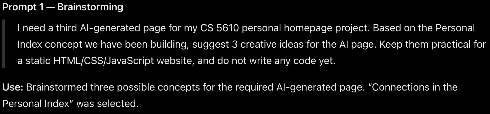
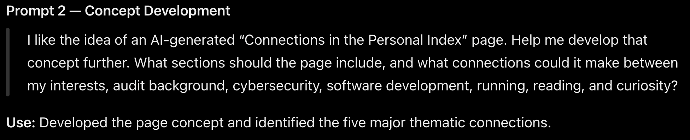
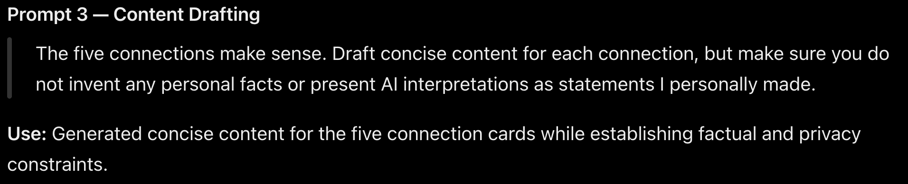
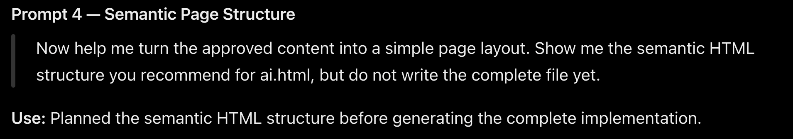
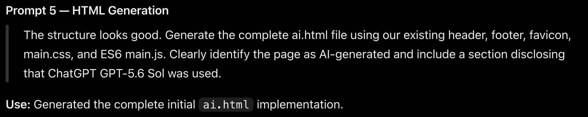
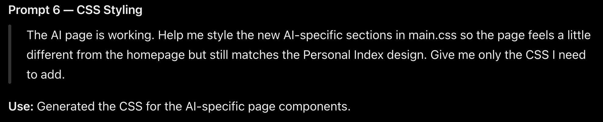
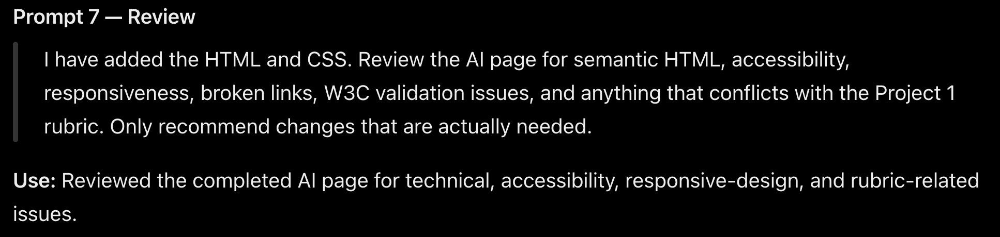

# AI Page — Generative AI Prompt Disclosure

This document records the ChatGPT prompts used to create and refine the required AI-generated page for **CS 5610 Project 1**.

The instructor's primary disclosure requirement for this page is supported in two ways:

1. The prompt text is documented below.
2. Screenshots from the original ChatGPT conversation are included as visual evidence of the prompts and responses.

## Tool and Model

- **Tool:** ChatGPT
- **Model:** GPT-5.6 Sol
- **Provider:** OpenAI
- **Purpose:** Create and refine the required third AI-generated page, `ai.html`

## Screenshot Folder

Chat screenshots for this disclosure should be stored in:

```text
images/screenshots/ai-prompts/
```

The filenames referenced below are:

```text
01-ai-page-ideas.png
02-concept-development.png
03-connection-content.png
04-semantic-structure.png
05-ai-page-generation.png
06-ai-page-styling.png
07-ai-page-review.png
08-ai-hero-image.png
```

---

## Prompt 1 — Brainstorming the AI Page

> I need a third AI-generated page for my CS 5610 personal homepage project. Based on the Personal Index concept we have been building, suggest 3 creative ideas for the AI page. Keep them practical for a static HTML/CSS/JavaScript website, and do not write any code yet.

**How it was used:** This prompt was used to brainstorm possible directions for the required third AI-generated page. The selected direction became **Connections in the Personal Index**.

### Chat Screenshot



---

## Prompt 2 — Developing the Selected Concept

> I like the idea of an AI-generated “Connections in the Personal Index” page. Help me develop that concept further. What sections should the page include, and what connections could it make between my interests, audit background, cybersecurity, software development, running, reading, and curiosity?

**How it was used:** This prompt developed the page concept and established the themes that would become the five connection cards.

### Chat Screenshot



---

## Prompt 3 — Drafting the Connection Content

> The five connections make sense. Draft concise content for each connection, but make sure you do not invent any personal facts or present AI interpretations as statements I personally made.

**How it was used:** This prompt generated initial copy for the five connections while explicitly limiting the AI to facts and themes already supplied for the project.

### Chat Screenshot



---

## Prompt 4 — Planning the Semantic Structure

> Now help me turn the approved content into a simple page layout. Show me the semantic HTML structure you recommend for ai.html, but do not write the complete file yet.

**How it was used:** This prompt was used to plan the semantic HTML structure before generating the full page.

### Chat Screenshot



---

## Prompt 5 — Generating the Initial AI Page

> The structure looks good. Generate the complete ai.html file using our existing header, footer, favicon, main.css, and ES6 main.js. Clearly identify the page as AI-generated and include a section disclosing that ChatGPT GPT-5.6 Sol was used.

**How it was used:** This prompt produced the initial implementation of `ai.html`, including the AI disclosure section.

### Chat Screenshot



---

## Prompt 6 — Styling the AI Page

> The AI page is working. Help me style the new AI-specific sections in main.css so the page feels a little different from the homepage but still matches the Personal Index design. Give me only the CSS I need to add.

**How it was used:** This prompt created the AI-page-specific CSS while keeping the page visually consistent with the rest of the site.

### Chat Screenshot



---

## Prompt 7 — Reviewing the AI Page

> I have added the HTML and CSS. Review the AI page for semantic HTML, accessibility, responsiveness, broken links, W3C validation issues, and anything that conflicts with the Project 1 rubric. Only recommend changes that are actually needed.

**How it was used:** This prompt was used for a final review of the AI page, including semantics, accessibility, responsive behavior, links, W3C compliance, and rubric alignment.

### Chat Screenshot



---

## AI-Generated Hero Illustration

The AI page also includes an AI-generated visual used as the hero illustration.

The exact image-generation wording is not reproduced here because the original text prompt was not preserved in the prompt log available during documentation. The screenshot of the original image-generation exchange should therefore be included as the primary evidence of that interaction.

### Chat Screenshot


---

## Human Review

All AI-generated content and code were reviewed before being incorporated into the project.

The generated page was:

- Reviewed for consistency with information already provided
- Edited where necessary
- Tested in the browser
- Checked for responsive behavior
- Reviewed for accessibility
- Checked with ESLint and Prettier where applicable
- Validated with the W3C Nu HTML Checker

The final implementation therefore reflects both AI-assisted development and human review.
