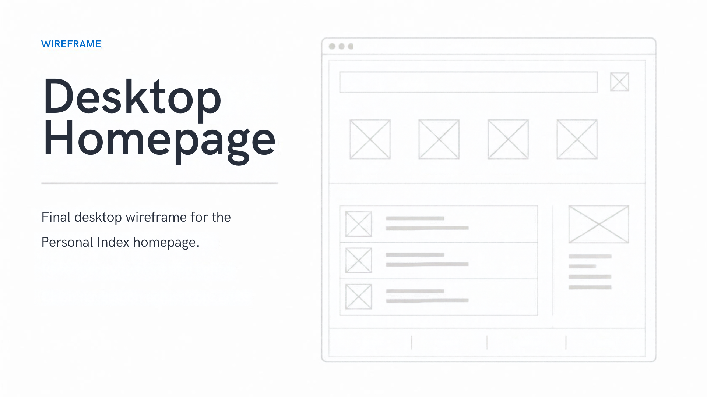
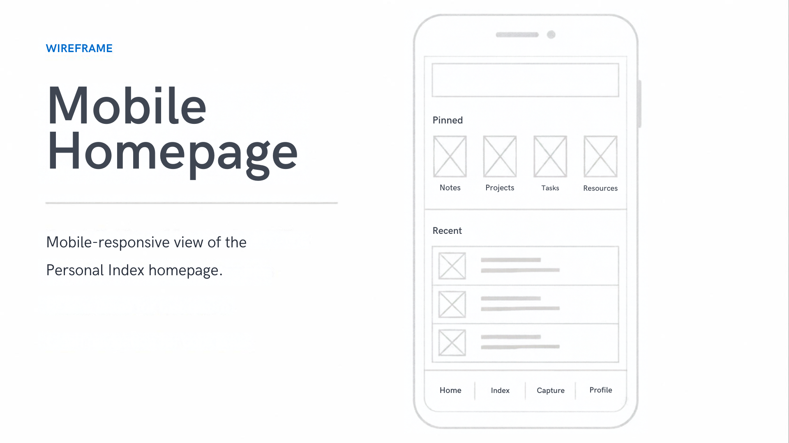
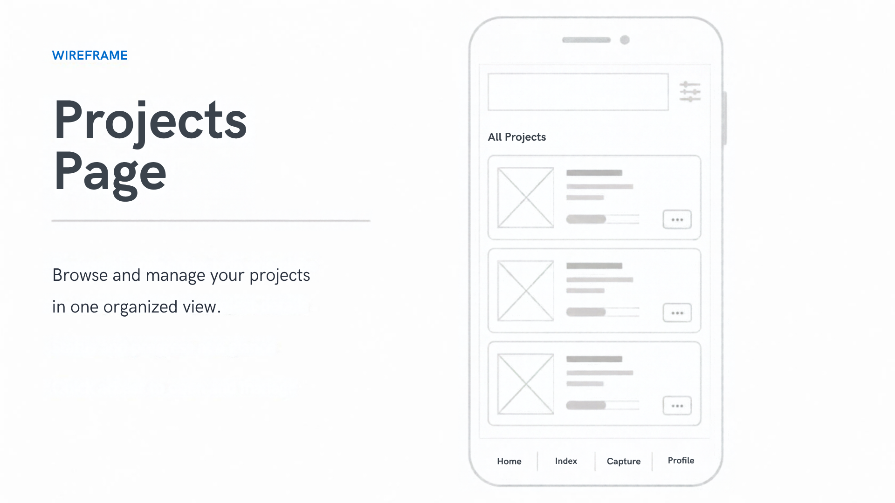
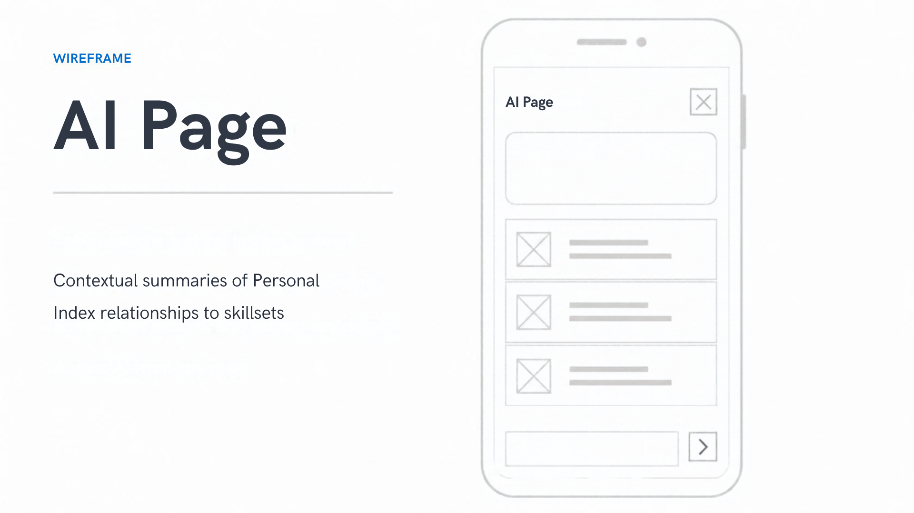

# Project 1 Design Document

## Project Title

**The Personal Index**

---

## Project Description

The Personal Index is a responsive personal homepage designed to present a well-rounded picture of who I am beyond a traditional résumé or professional portfolio.

The site introduces visitors to my personal background, professional journey, interests, transition into Information Technology and Computer Science, and selected technical projects.

The final website consists of three pages:

- `index.html` — primary personal homepage
- `projects.html` — expanded projects and professional-transition context
- `ai.html` — required AI-generated page exploring connections among existing themes from the website

The site uses a minimal, modern visual style built around typography, spacing, subtle borders, imagery, responsive grids, and interactive JavaScript components.

The website is implemented as a front-end-only static site using:

- HTML5
- CSS3
- ES6+ JavaScript
- ES6 modules
- CSS Grid
- Flexbox

The project does not use:

- A backend
- jQuery
- Bootstrap
- Component libraries or frameworks

The primary goal is to create a homepage that feels personal, informative, visually engaging, accessible, and easy to navigate while also demonstrating concepts learned in CS 5610.

---

## Concept

The website functions as a **personal index**.

Rather than organizing my life as a chronological timeline, the website presents several areas of my background and interests that visitors can explore independently.

The primary themes are:

- Personal background
- Professional experience
- Information Technology and Computer Science
- Running
- Music
- Reading
- Movies and television
- Travel
- Technology
- Technical projects

This structure allows visitors to quickly understand different aspects of who I am without requiring them to follow a fixed chronological sequence.

---

## Design Goals

The website should:

- Feel minimal, modern, and personal
- Present meaningful personal and professional information
- Avoid looking like a traditional résumé
- Make technical projects easy to locate
- Explain the connection between my audit background and technology interests
- Provide interactive elements that encourage exploration
- Use imagery without overwhelming the content
- Work effectively on desktop, tablet, and mobile screens
- Use clear visual hierarchy and consistent spacing
- Use semantic and accessible HTML
- Include original JavaScript functionality
- Remain maintainable so interests and projects can be updated later

---

## Privacy and Content Guidelines

The website respects the following personal boundaries:

- My public profile photo may be used
- Personal family information is not included
- Private family or childhood photographs are not used
- Personal drawings remain private
- Personal information is limited to details I am comfortable presenting publicly

Visual interest instead comes from:

- Typography
- Layout and spacing
- CSS Grid and Flexbox
- Curated stock photography
- Project screenshots
- Book, media, and interest imagery
- Country flags
- An AI-generated illustration on the AI page
- Subtle borders and accent colors
- Hover, focus, and active states
- JavaScript-driven interactions

---

## About Me

I was born in Ghana, West Africa, and moved to the United States at age eight.

I spent most of my life in Hartford County, Connecticut.

My professional background includes more than ten years of experience across:

- Accounting
- Internal audit
- SOX compliance
- Operational risk
- Financial controls
- Public accounting

I am currently expanding that professional background into technology.

I am pursuing Information Technology and Computer Science at Northeastern University while developing practical experience in areas including:

- Web development
- Programming
- Cybersecurity
- Software development
- Automation

---

## Personal Interests

### Running

I participated in track and cross country and continue to have a love-hate relationship with running.

The interactive spotlight uses supporting imagery representing:

- Track
- Cross country
- The runner's high

### Music

Some of my favorite artists include:

- Michael Jackson
- Lauryn Hill
- Nina Simone

Supporting artist imagery is displayed when the Music interest is selected.

### Reading

Authors and books represented include:

- Robert Greene — _The 48 Laws of Power_
- Robert Greene — _The Laws of Human Nature_
- Alan Watts — _The Way of Zen_

Book-cover imagery is displayed in the Interest Spotlight.

### Movies and Television

Comedy and action are generally my preferred movie genres.

Current television favorites represented on the site include:

- Dark Matter
- The Three-Body Problem
- House of the Dragon

Poster imagery is displayed when Movies + TV is selected.

### Travel

Places I would especially like to explore include:

- Tokyo, Japan
- Casablanca, Morocco
- Santiago, Chile

The Travel interaction includes selectable destination controls, country flags, and short descriptions explaining what interests me about each location.

### Technology

Technology interests represented visually include:

- Software development
- Cybersecurity
- Automation

These interests connect directly to my current academic and project work.

---

## Target Audience

The homepage is intended for:

- Friends and general visitors
- Classmates
- Professors
- Recruiters
- Hiring managers
- Software-development professionals
- Cybersecurity professionals
- Visitors interested in my technical projects

---

## User Personas

### Persona 1 — Casual Visitor

**Name:** Alex  
**Role:** Friend, classmate, or general visitor

**Goal:** Learn who I am beyond my academic or professional background.

#### Needs

- Clear personal introduction
- Background information
- Interests and hobbies
- Easy navigation
- Engaging visual content
- Mobile-friendly presentation

---

### Persona 2 — Technical Recruiter

**Name:** Sarah  
**Role:** Technical recruiter

**Goal:** Quickly understand my professional background, technical education, career direction, and project experience.

#### Needs

- Professional overview
- Career-transition context
- Technology interests
- Selected projects
- GitHub access
- Contact information

---

### Persona 3 — Engineering or Cybersecurity Hiring Manager

**Name:** Michael  
**Role:** Engineering or cybersecurity hiring manager

**Goal:** Evaluate my technical interests, practical projects, and transferable professional experience.

#### Needs

- Project descriptions
- Technologies used
- GitHub repositories
- Live demonstrations where available
- Evidence of continued technical learning
- Explanation of how audit and risk experience relate to technology

---

### Persona 4 — Professor or Classmate

**Name:** Jordan  
**Role:** CS 5610 student or instructor

**Goal:** Review the site as a web-development project.

#### Needs

- Semantic HTML
- Responsive layouts
- Accessible navigation
- Original JavaScript functionality
- Organized project structure
- Valid HTML
- Clear design decisions
- Visible AI-use disclosure

---

## User Stories

### Casual Visitor

As a casual visitor, I want to learn about John's background so that I can understand where he comes from.

As a casual visitor, I want to select different interests so that I can explore the things John enjoys outside of work and school.

As a casual visitor, I want to see visual examples related to John's interests so that the experience feels more engaging than reading text alone.

As a casual visitor interested in travel, I want to select destinations so that I can learn why those places interest John.

---

### Recruiter

As a recruiter, I want to quickly understand John's professional and academic background so that I can understand his career direction.

As a recruiter, I want to see the connection between John's audit experience and technology interests so that his transition into technology is clear.

As a recruiter, I want quick access to selected projects and GitHub repositories so that I can review his technical work.

---

### Hiring Manager

As a hiring manager, I want to see technical project examples so that I can evaluate John's developing practical experience.

As a hiring manager, I want project descriptions to identify technologies used so that I can quickly determine their relevance.

As a hiring manager, I want direct links to project repositories and live applications so that I can explore the work in more depth.

---

### Professor or Classmate

As a professor or classmate, I want the website to be easy to navigate so that I can review the assignment efficiently.

As a professor or classmate, I want the layout to adapt across multiple screen sizes so that the responsive-design work is visible.

As a professor or classmate, I want to interact with original JavaScript features so that the project demonstrates concepts learned in class.

As a professor or classmate, I want the AI-generated content to be clearly identified so that the use of generative AI is transparent.

---

## Information Architecture

The website contains three primary pages:

1. Home
2. Projects
3. AI-generated page

---

## Page 1 — Homepage

**File:** `index.html`

The homepage includes:

1. Header and navigation
2. About / hero section
3. Interactive Interests section
4. Featured Projects
5. Footer

### Navigation

The primary navigation contains:

```text
About | Projects | AI Page
```

The navigation remains intentionally compact.

On smaller screens, a JavaScript-controlled menu button exposes the navigation links.

---

## About / Hero Section

The homepage begins with a two-column About section on larger screens.

The left side contains my profile photograph.

The right side contains:

- Name
- Background
- Professional Journey
- Where I'm Going

The section introduces visitors to my personal history, professional experience, and transition toward technology.

On smaller screens, the image and content stack vertically.

---

## Interactive Interests Section

The primary original interaction on the homepage is the **Interest Spotlight**.

Visitors can select one of six categories:

```text
Running
Music
Reading
Movies + TV
Travel
Technology
```

Each category is implemented as a semantic `<button>`.

Selecting a category dynamically updates:

- Main spotlight image
- Spotlight title
- Description
- Active button state
- Supporting media where appropriate

The interaction is implemented using original ES6 JavaScript.

### Supporting Interest Media

Running, Music, Reading, Movies + TV, and Technology display supporting three-item media galleries.

Examples include:

- Running experiences
- Favorite musical artists
- Book covers
- Television posters
- Technology areas

JavaScript dynamically creates these cards based on data stored in the `interests` object.

### Travel Interaction

Travel uses a related secondary interaction.

Selecting Travel reveals three destination buttons:

- Tokyo, Japan
- Casablanca, Morocco
- Santiago, Chile

Each button contains the country's flag and updates the destination description.

The control communicates its state using:

```html
aria-pressed="true"
```

or:

```html
aria-pressed="false"
```

---

## Featured Projects

The homepage contains three featured technical projects.

Each project card includes:

- Screenshot or representative image
- Project name
- Brief description
- Technologies used
- GitHub or live-project links

The current featured work includes:

- SecretTrace
- Airbnb Listings
- HTML, CSS & JavaScript Self-Assessment

---

## Page 2 — Projects

**File:** `projects.html`

The Projects page expands the technical and professional side of the website.

It contains three major content areas.

### Turning Learning Into Practice

The page begins with an introduction describing how technical projects allow me to apply concepts from Information Technology and Computer Science.

A wide coding-related banner image reinforces the practical-learning theme.

### From Audit to Technology

This section explains how my professional experience connects to my current technical development.

#### Foundation — What I Bring

Examples include:

- Internal Audit
- SOX Compliance
- Operational Risk
- Financial Controls
- Process Evaluation

#### Growth — What I'm Building

Examples include:

- Software Development
- Cybersecurity
- Web Development
- Programming
- Automation

#### The Connection — Systems Thinking

A wider connection card explains how evaluating processes, weaknesses, risk, and controls influences the way I approach learning to build and secure technology.

### Selected Projects

The Projects page provides expanded versions of the featured project cards.

Cards include:

- Images
- Project descriptions
- Technology tags
- Additional project context
- GitHub links
- Live demonstrations where available

---

## Page 3 — AI-Generated Page

**File:** `ai.html`

The third page is intentionally AI-generated as required by the assignment.

The page is titled:

**Connections in the Personal Index**

It includes an AI-generated visual and five conceptual connections:

1. Audit → Cybersecurity
2. Risk → Software Development
3. Running → Persistence
4. Reading → Perspective
5. Curiosity → Building

The connections are presented as AI interpretations of information already provided for the website rather than new biographical claims.

The page also contains a transparency section documenting:

- Tool used
- Model used
- Purpose
- Source information
- Human review

Generative AI use is additionally documented in the project README.

---

## User Interface and User Experience Strategy

### Navigation

Navigation is intentionally concise and consistent across pages.

The site uses:

```text
About | Projects | AI Page
```

The site logo always returns to the homepage.

On smaller screens, the navigation becomes a menu controlled with JavaScript and appropriate ARIA attributes.

### Visual Hierarchy

Hierarchy is established through:

- Large page headings
- Small uppercase section labels
- Consistent card borders
- Muted supporting text
- Generous whitespace
- Accent colors
- Image scale
- Repeated section spacing

### Readability

The design prioritizes:

- Strong text contrast
- Consistent spacing
- Short paragraphs
- Responsive typography
- Clear headings
- Scannable cards
- Comfortable line lengths

### Interaction Feedback

Interactive elements provide visible:

- Hover states
- Focus states
- Active states

Standard HTML controls are used instead of simulated controls built from non-semantic elements.

---

## Visual Design Strategy

The final visual direction is:

- Minimal
- Modern
- Warm
- Editorial
- Content-focused
- Image-supported rather than image-dominated

The palette uses an off-white background, dark text, muted blue-gray accents, subtle borders, and restrained shadows.

Rounded cards and consistent spacing establish visual continuity across pages.

---

## Responsive Design

The site follows a mobile-first responsive approach.

### Small Screens

Content primarily uses a single-column layout.

Navigation collapses behind a menu button.

Interest selectors, spotlight content, project cards, and professional-context cards stack vertically.

### Medium Screens

Grid layouts expand to two columns where appropriate.

### Large Screens

The site uses:

- Two-column About layout
- Three-column interest selector grid
- Split Interest Spotlight layout
- Multi-column project grids
- Side-by-side professional-context cards
- Horizontal AI connection cards

---

## Accessibility Strategy

The website includes:

- Semantic HTML5 elements
- A skip-to-content link
- Alternative text values for images
- Decorative images with empty `alt` values where appropriate
- Keyboard-accessible buttons and links
- Visible focus states
- `aria-expanded` for mobile navigation
- `aria-controls` for controlled navigation
- `aria-pressed` for selectable interest and travel controls
- Descriptive page titles and metadata
- Appropriate heading hierarchy
- Responsive text and layouts

All three HTML pages are checked using the W3C validator.

---

## Technical Plan

The site uses:

- HTML5
- CSS3
- Vanilla ES6+ JavaScript
- ES6 modules
- CSS Grid
- Flexbox
- Git
- GitHub
- ESLint
- Prettier

JavaScript is divided into modules.

`main.js` imports and initializes the site's interactive functionality.

The site uses:

```html
<script type="module" src="./js/main.js"></script>
```

The `package.json` file also contains:

```json
{
  "type": "module"
}
```

---

## Project Structure

```text
personal-homepage/
├── index.html
├── projects.html
├── ai.html
├── README.md
├── LICENSE
├── package.json
├── css/
│   └── main.css
├── js/
│   ├── main.js
│   ├── navigation.js
│   └── interest-spotlight.js
├── images/
│   ├── ai/
│   ├── icons/
│   ├── interests/
│   │   └── media/
│   ├── profile/
│   └── projects/
├── docs/
│   ├── design.md
│   └── mockups/
└── screenshots/
```

---

## Design Mockups

The final design process includes four low-fidelity wireframes that document
the completed website structure:

- Desktop homepage
- Mobile homepage
- Projects page
- AI-generated page

The mockups represent the final design direction, including:

- Simplified primary navigation
- About / hero section
- Interactive Interest Spotlight
- Featured Projects
- Professional Context section
- AI-generated Connections page
- Footer
- Responsive mobile stacking

The implementation evolved from earlier concepts during development. The final mockups therefore reflect the completed design rather than the earlier Personal Index, Currently, and Explore My Index concepts.

### Desktop Homepage Mockup



### Mobile Homepage Mockup



### Projects Page Mockup



### AI Page Mockup



---

## Final Homepage Wireframe

```text
┌──────────────────────────────────────────────────────────┐
│ JOHN PAINTSIL                     ABOUT PROJECTS AI PAGE │
├──────────────────────────────────────────────────────────┤
│                                                          │
│ PROFILE IMAGE          ABOUT ME                          │
│                        John Paintsil                     │
│                        Background                        │
│                        Professional Journey              │
│                        Where I'm Going                   │
│                                                          │
├──────────────────────────────────────────────────────────┤
│ INTERESTS                                                │
│ A Few Things About Me                                    │
│                                                          │
│ Running       Music         Reading                      │
│ Movies + TV   Travel        Technology                   │
│                                                          │
│ ┌────────────────────┬─────────────────────────────────┐ │
│ │ SPOTLIGHT IMAGE    │ CURRENTLY EXPLORING             │ │
│ │                    │ Title                           │ │
│ │                    │ Description                     │ │
│ │                    │ Supporting media / travel       │ │
│ └────────────────────┴─────────────────────────────────┘ │
├──────────────────────────────────────────────────────────┤
│ FEATURED PROJECTS                                        │
│                                                          │
│ SecretTrace        Airbnb Listings       Web Assessment  │
├──────────────────────────────────────────────────────────┤
│ FOOTER                                                   │
│ GitHub | Email | Back to Top                            │
└──────────────────────────────────────────────────────────┘
```

---

## Projects Page Wireframe

```text
┌──────────────────────────────────────────────────────────┐
│ JOHN PAINTSIL                     ABOUT PROJECTS AI PAGE │
├──────────────────────────────────────────────────────────┤
│ PROJECTS                                                 │
│ Turning Learning Into Practice                           │
│ Introductory project/career-transition text              │
│                                                          │
│ ┌──────────────────────────────────────────────────────┐ │
│ │                PROJECT BANNER IMAGE                 │ │
│ └──────────────────────────────────────────────────────┘ │
├──────────────────────────────────────────────────────────┤
│ PROFESSIONAL CONTEXT                                     │
│ From Audit to Technology                                 │
│                                                          │
│ ┌──────────────────────┐ ┌────────────────────────────┐ │
│ │ FOUNDATION           │ │ GROWTH                     │ │
│ │ What I Bring         │ │ What I'm Building          │ │
│ └──────────────────────┘ └────────────────────────────┘ │
│                                                          │
│ ┌──────────────────────────────────────────────────────┐ │
│ │ THE CONNECTION — SYSTEMS THINKING                  │ │
│ └──────────────────────────────────────────────────────┘ │
├──────────────────────────────────────────────────────────┤
│ SELECTED WORK                                            │
│ Featured Projects                                       │
│                                                          │
│ Project 1        Project 2        Project 3              │
├──────────────────────────────────────────────────────────┤
│ FOOTER                                                   │
└──────────────────────────────────────────────────────────┘
```

---

## AI Page Wireframe

```text
┌──────────────────────────────────────────────────────────┐
│ JOHN PAINTSIL                     ABOUT PROJECTS AI PAGE │
├──────────────────────────────────────────────────────────┤
│ AI-GENERATED EXPERIMENT                                  │
│ Connections in the Personal Index                        │
│                                                          │
│ ┌──────────────────────────────────────────────────────┐ │
│ │             AI-GENERATED HERO VISUAL               │ │
│ └──────────────────────────────────────────────────────┘ │
├──────────────────────────────────────────────────────────┤
│ AI INTERPRETATION                                        │
│ Five Connections                                         │
│                                                          │
│ 01  Audit → Cybersecurity          Explanation           │
│ 02  Risk → Software Development   Explanation           │
│ 03  Running → Persistence         Explanation           │
│ 04  Reading → Perspective         Explanation           │
│ 05  Curiosity → Building          Explanation           │
├──────────────────────────────────────────────────────────┤
│ TRANSPARENCY                                             │
│ How This Page Was Created                                │
│                                                          │
│ Tool | Model | Purpose | Source Information | Review     │
├──────────────────────────────────────────────────────────┤
│ FOOTER                                                   │
└──────────────────────────────────────────────────────────┘
```

---

## Design Evolution

The final implementation changed from the earliest mockup concepts as the project developed.

Notable changes include:

- The original Personal Index tag section was removed
- The original Currently section was removed
- The original Explore My Index filtering component was replaced
- About and hero content were combined into one stronger introduction
- Interests were redesigned around a shared interactive spotlight
- Supporting media galleries were added to the Interests section
- Travel received a secondary destination-selection interaction
- Work + Technology was moved from the homepage to the Projects page
- The Projects page gained a professional-context section and banner
- The AI page evolved into a dedicated Connections in the Personal Index experience
- Navigation was simplified to About, Projects, and AI Page

These changes were made to reduce repetition, improve visual hierarchy, and create a clearer distinction among the three pages.

---

## Success Criteria

The project is successful if a visitor can quickly understand:

1. My personal background
2. My professional experience
3. My transition toward Information Technology and Computer Science
4. My major interests
5. The kinds of technical projects I am developing
6. How my audit and risk experience connects to technology
7. Where to find my GitHub work

The completed website should remain:

- Responsive
- Accessible
- Easy to navigate
- Visually organized
- Personal
- Modern
- Interactive
- Content-rich without feeling cluttered
